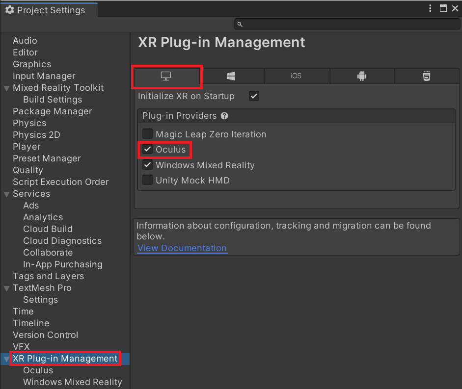
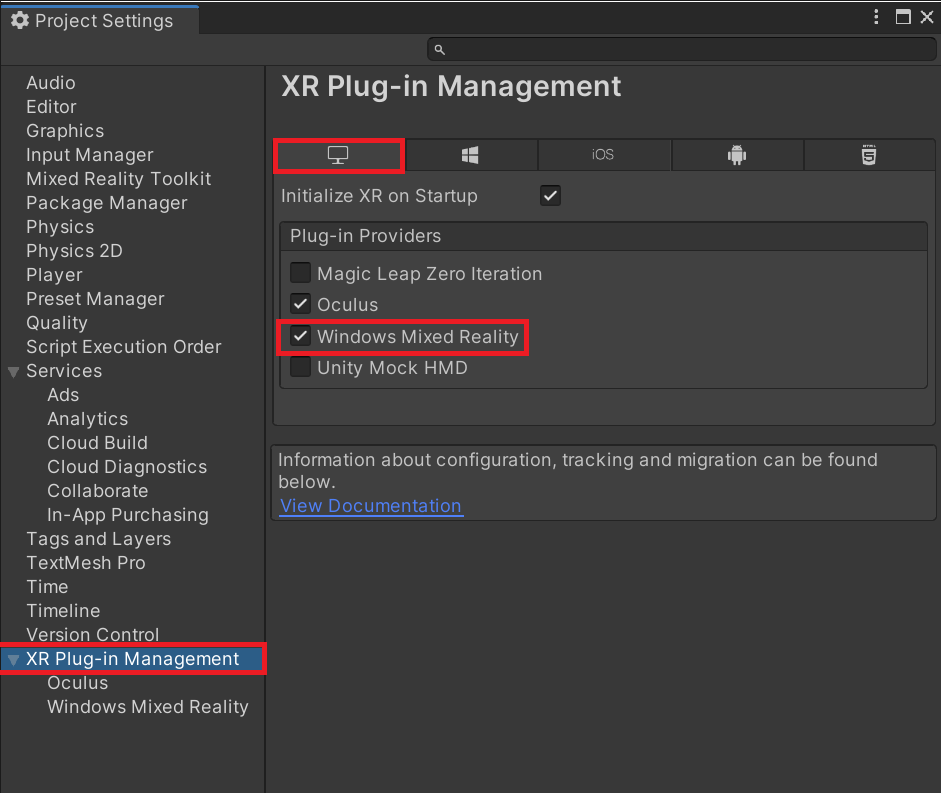
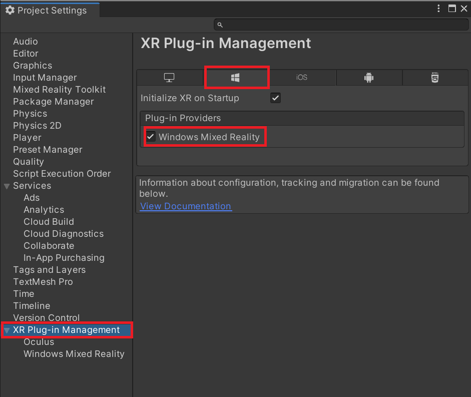
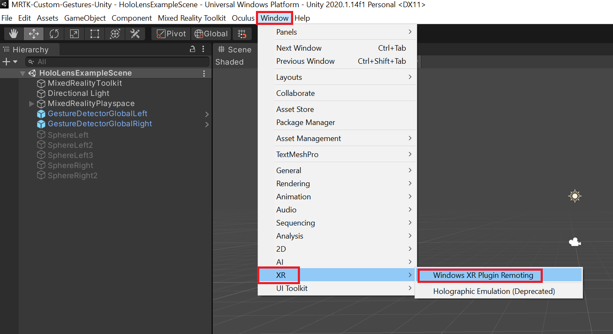
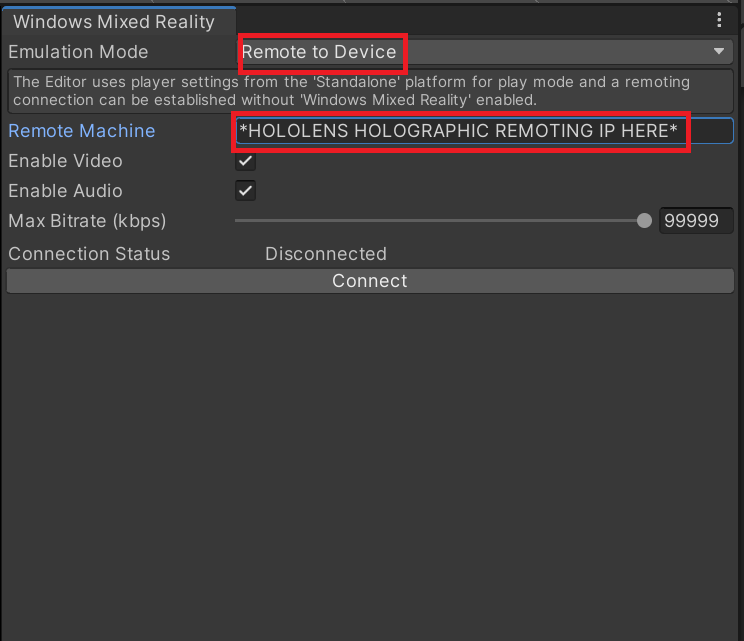
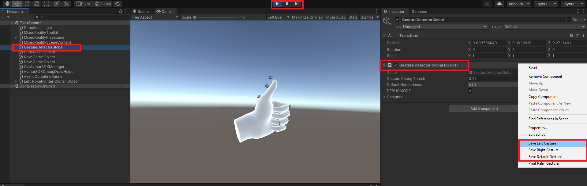
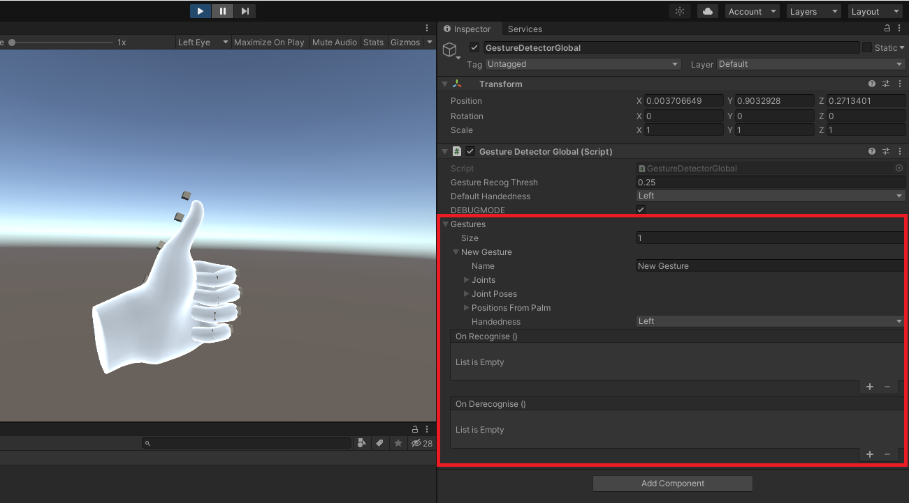
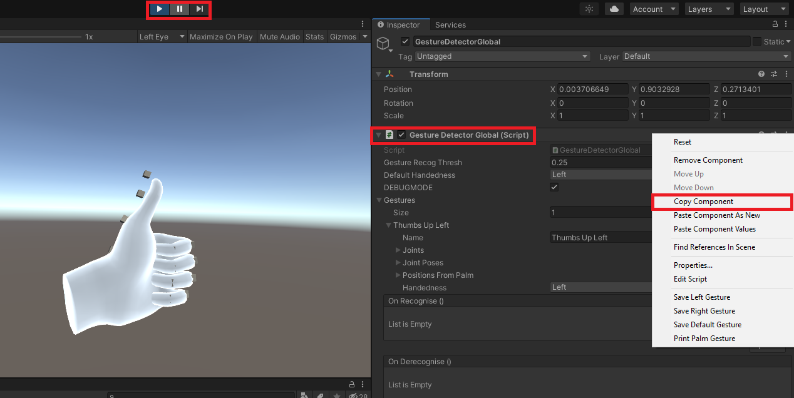
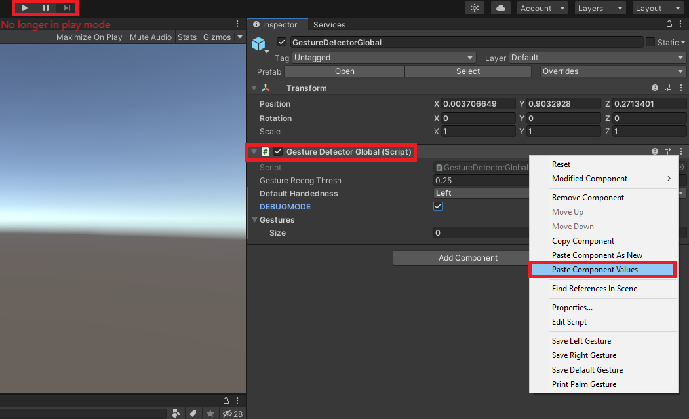
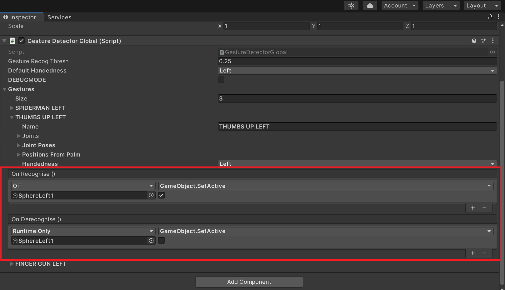

# Setting Up Custom Gestures in your Own Project

<!-- TABLE OF CONTENTS -->

  
Table of Contents

  <ol>
   <li>
      <a href="#oculus-quest-setup">Oculus Quest Setup</a>
   </li>
   <li>
      <a href="#hololens-setup">Hololens Setup</a>
   </li>
   <li>
      <a href="#using-custom-gestures">Using Custom Gestures</a>
      <ul>
         <li><a href="#i-setting-up-custom-gestures">I. Setting Up Custom Gestures</a></li>
      </ul>
      <ul>
         <li><a href="#ii-saving-new-custom-gestures">II. Saving New Custom Gestures</a></li>
      </ul>
   </li>
   <li>
      <a href="#things-to-note">Things to note</a>
   </li>
  </ol>

## Oculus Quest Setup

### I. Prerequisites
You will need to download and install the following:
* [Unity](https://unity3d.com/get-unity/download)

* [Mixed Reality Toolkit for Unity](https://docs.microsoft.com/en-us/windows/mixed-reality/develop/install-the-tools?tabs=unity)

* [Oculus Desktop Application](https://www.oculus.com/setup/)

### II. Setting Up Oculus Quest
1. Enable [Developer Mode in Settings](https://developer.oculus.com/documentation/native/android/mobile-device-setup/)
2. Plug in your Oculus to your Computer
3. Enable Oculus Link in Your Oculus Headset

### III. Setting Up in Unity for Oculus Quest

1. Ensure you enable Oculus support in Unity by:
   - Installing XR Plugin Manager to Enable Virtual Reality Support
   - Ticking Oculus in **BOTH *ANDROID* and *PC,MAX AND LINUX***
   

2. Test whether your project is displayed in your Oculus Headeset via Oculus Link when you press play in Unity
3. Import Mixed Reality Toolkit into your project

---
## HoloLens Setup

### I. Prerequisites
You will need to download and install the following:
* [Unity](https://unity3d.com/get-unity/download)

* [Mixed Reality Toolkit for Unity](https://docs.microsoft.com/en-us/windows/mixed-reality/develop/install-the-tools?tabs=unity)

### II. Setting Up HoloLens 2
1. Enable [Developer Mode in Settings](https://docs.microsoft.com/en-us/windows/mixed-reality/develop/platform-capabilities-and-apis/using-visual-studio?tabs=hl2)
2. Download [Holographic Remoting Application](https://docs.microsoft.com/en-us/windows/mixed-reality/develop/platform-capabilities-and-apis/holographic-remoting-player) on your HoloLens 2

3. Run the Holographic Remoting Application, where it will display your Hololen's IP address.

### III. Setting Up in Unity for HoloLens 2

1. Ensure you enable HoloLens support in Unity by:
   - Installing XR Plugin Manager to Enable Virtual Reality Support
   - Ticking Windows Mixed Reality in **BOTH *Universal Windows Platform (UWP)* and *PC,MAX AND LINUX***
   

2. Import Mixed Reality Toolkit into your project

3. Open the XR Plugin Remoting Window by going to Window -> XR -> Windows XR Plugin Remoting

4. Connect to your Hololens by Selecting *Remote to Device* in the XR Remoting Window, inserting your HoloLens IP and selecting Connect
   - In your HoloLens, the prompt displaying the IP should disappear when displayed correctly

5. Test whether pressing play would display your project in your HoloLens

---
## Using Custom Gestures

### I. Setting Up Custom Gestures

1. Import this package into your unity project
   
   Alternatively, you can also copy the GestureDetectorGlobal.cs script into your project

2. Attach the GestureDetectorGlobal.cs Script to an active gameobject in your scene.
   
   Alternatively, the provided GestureDetectorGlobal prefab can be placed inside too.

3. Enable DEBUGMODE on the GestureDetectorGlobal component

4. Specify the Default Handedness this component will try to detect from (eg: Left, Right, Both).
   - If you specify both, only one gesture can be detected on either hand at once by this object

### II. Saving New Custom Gestures

1. Press play in Unity to play the scene on your Hololens 2 / Oculus
2. Find the GestureDetectorGlobal component on the gameObject in the scene

3. Right Click on the GestureDetectorGlobal component
4. Click on Save the gesture for the corresponding hand.
5. You should see a "New Gesture" in the Gestures of the inspector

6. Edit the name and properties of the gesture if you want
7. Right click on the GestureDetectorGlobal component and select *Copy Component*

8. Exit Play mode on Unity
   - You will see on the component that your saved gesture will be gone 
9. Click on the same GestureDetectorGlobal component and Right Click and select *Paste Component as New*
   - Now the saved Gesture will reappear and will stay

10. Add custom events to the gesture OnRecognise and OnDerecognise

11. Tweak the Gesture Recognition Threshold property if it is triggering too often or not often enough
    - We find that 0.25 works well for Oculus Quest, and 0.28 for HoloLens

12. Repeat for as many gestures as you like.
13. Once done, untick DEBUG MODE

Then, you'll be able to do things like this:

---
### Things to note:
- Gesture detection may vary depending on differences in hand size - try experimenting with different threshold values in the 
- Number of joints in Oculus is only 22, while in HoloLens it is 26. Therefore, gestures recorded on one device may not register when in another. Recommended to record different gestures for different devices.
- Instead of Right-Clicking the Component and Saving the Gestures, the arrow keys left, right and down can also trigger the saving of gestures.